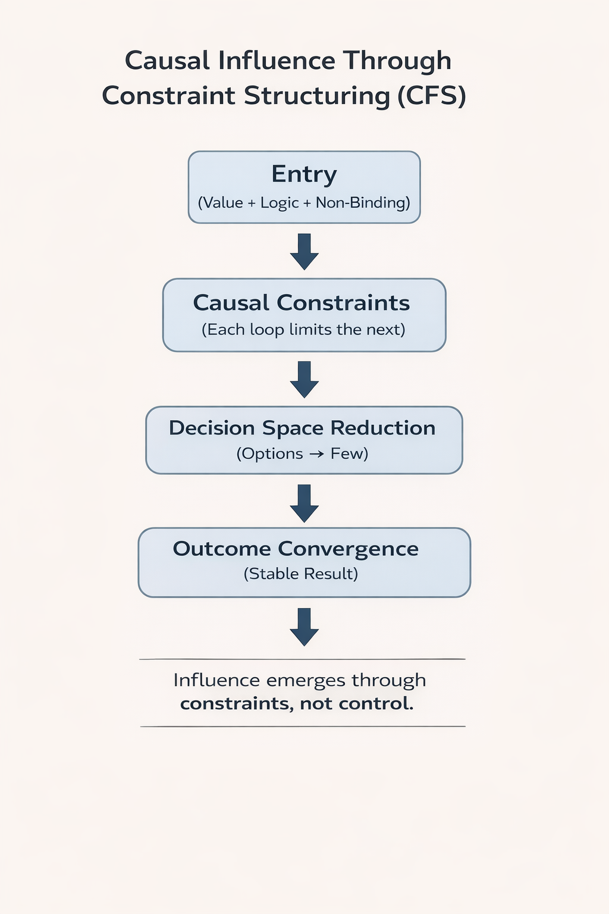

# CFS (Cognitive Flow System)

CFS is a causal framework for understanding how decisions emerge in complex systems through structured causal constraints rather than direct control.

DOI (CFS 2.2):
https://doi.org/10.5281/zenodo.19142077

---

## What is CFS?

CFS models influence as a function of constraint structuring rather than direct authority.

Influence is not imposed — it emerges.

---

## Core Principles

- Entry Loop = Value + Logic + Non-Binding  
- Each Loop Constrains the Next  
- Decision space reduces over time  
- Outcomes converge under constraints  

---

## Concept
---

## Case Study

CFS applied to high-pressure geopolitical systems:

- Strategic Flow Convergence Case Study

## Book (In Progress)

- Chapter 1 — Unified Flow–Constraint Model

---

## Versions

- CFS 2.2 (2026) — Application & Expansion  
  https://doi.org/10.5281/zenodo.19142077  

- CFS 2.1 (2026) — Empirical Alignment  
  https://doi.org/10.5281/zenodo.19103972  

- CFS 2.0 (2026) — Core Framework  

---

## Applications

- Strategic Planning  
- Diplomatic Systems  
- Organizational Decision-Making  
- AI Systems  
- Complex Systems Analysis  

---

## Author

Abdulaziz (Vision To Field)

---

## Note

CFS (Cognitive Flow System) is distinct from other uses of the acronym CFS (e.g., Causal Functional Structure or Causal Feature Selection).
